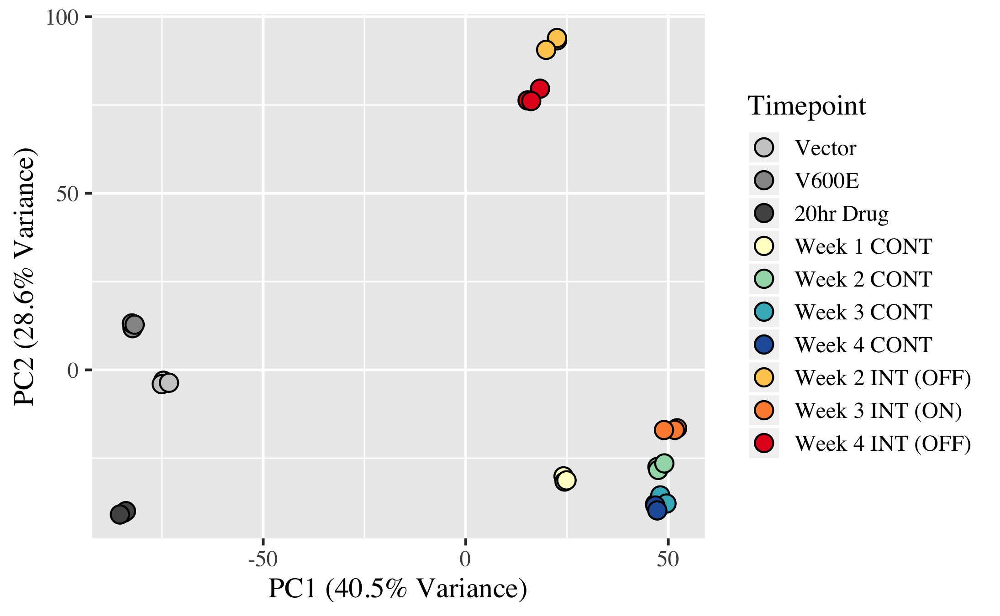

# Intermittent Drug Treatment of BRAFV600E Melanoma Cells Delays Resistance by Sensitizing Cells to Rechallenge

This module contains the code and data used to generate figures in Stuart et al. 2018. The code is in R Markdown files and returns .html documents of the output alog with eps files of figures and csv files of tables.

To generate all the figures, execute the run.sh file.

#### Version Numbers
R version 3.5.1 was used to run all R markdown files.

The following libraries and versions were used to generate the figures in the paper: tidyr_0.8.1; stringr_1.3.1; readr_1.1.1; scales_0.5.0; dplyr_0.7.6; magrittr_1.5; RColorBrewer_1.1-2; ggplot2_3.0.0; pheatmap_1.0.10; DESeq2_1.20.0; BiocParallel_1.14.2; 
